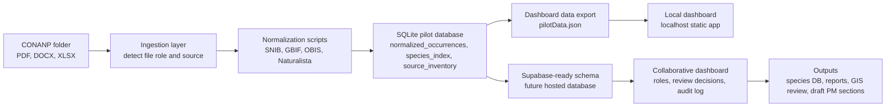

# CONANP Call Briefing

Date: June 11, 2026  
Purpose: Explain the dashboard and position it as a first working pilot foundation, not as a final scientific/legal product.

## Opening Script

What we sent is a first operational mockup showing how CONANP could move from a folder of disconnected documents and databases into a single traceable workspace. The goal is not to replace CONANP's technical judgment. The goal is to release the team from repetitive consolidation work, preserve evidence, flag what needs review, and give specialists a faster way to validate and use the information.

The dashboard is connected to the pilot database we built from the files CONANP sent: Decretos, EPJ, SIG/economy-demography references, and biodiversity spreadsheets from SNIB, GBIF, Naturalista, and OBIS.

## What The Dashboard Actually Shows

- 181,528 biodiversity records were normalized into one common structure.
- 78,511 representative occurrence records were generated after duplicate grouping.
- 12,693 ANP-level taxa were indexed across the three protected areas.
- Each row preserves source traceability: source system, source file, row number, record ID, license, URL/citation where available, and quality flags.
- The dashboard is currently local/mockup-backed, with a Supabase schema ready for cloud deployment.

## Core Explanation

The dashboard has three jobs:

1. **Consolidate**: Take heterogeneous sources and put them into a single shared model.
2. **Audit**: Preserve where each claim came from, so CONANP can defend the data.
3. **Route work**: Move uncertain records into expert review instead of hiding uncertainty.

This is why the dashboard includes a species explorer, review queue, source inventory, traceability view, synonym module, GIS validation module, automation module, visualization page, and draft Program of Management preview.

## Logistical Connection We Made

In this first version, the dashboard reads from a local JSON export generated from the SQLite database. That keeps the demo fast and stable. For a hosted version, the same tables can be loaded into Supabase using the schema included in the project.

## Defensible Points

- **We are not claiming final scientific validation yet.** We are showing that the consolidation and traceability foundation works.
- **The AI does not erase uncertainty.** It makes uncertainty visible through quality flags and review queues.
- **Original records are preserved.** Deduplication creates a representative layer, but raw/source traceability remains.
- **CONANP remains the authority.** Expert approval is required for taxonomy, geography, legal interpretation, and final text.
- **The dashboard is built from their files.** The numbers are not dummy placeholders; they come from the supplied pilot data.
- **This is scalable.** The same pattern can process additional ANPs, sources, literature, and future document sets.
- **This reduces manual workload.** Staff no longer need to manually reconcile spreadsheets before doing expert review.
- **The most valuable feature is traceability.** Any generated table, recommendation, or draft should link back to its source.

## Likely Questions And Suggested Answers

**Is this already scientifically validated?**  
No. This is a consolidation and triage layer. It prepares the data for scientific validation by preserving evidence, grouping duplicates, and flagging records needing taxonomic or geographic review.

**Can the AI remove duplicates automatically?**  
It can group likely duplicates and propose representative records. Final merge rules should be agreed with CONANP, especially where records differ by source, date, coordinates, or taxonomic authority.

**How are synonyms handled?**  
In this pilot, we use accepted/current names already present in source authorities such as SNIB/CONABIO, GBIF, OBIS/WoRMS, and Naturalista. The next version would connect directly to taxonomic authority APIs and require specialist approval before changing accepted names.

**Can this check whether species belong geographically to the ANP?**  
The foundation is ready because records have coordinates and ANP labels. The next step is to load official ANP polygons and biogeographic/range references, then classify records as inside, near boundary, outlier, or requiring review.

**What happens with scientific publications?**  
The publication module would search, screen, ingest PDFs, extract taxon mentions/tables, and merge them as a separate traceable source. It should never blend literature records into the database without a source label and review status.

**Can this generate Programas de Manejo text?**  
Yes, but only after data and source traceability are in place. The draft module should generate text with linked citations and mark any unvalidated claims as pending review.

**Why Supabase? Why not Firebase?**  
Supabase is a better first fit because the data is relational: ANPs, sources, occurrences, species, flags, review decisions, and source inventory. Firebase can work for realtime UI, but Supabase maps more naturally to SQL tables, filtering, joins, and audit workflows.

**Does this replace CONANP personnel?**  
No. It removes repetitive consolidation work and gives specialists a clearer review queue. The value is making expert time more focused, not replacing technical authority.

**How would permissions work?**  
A hosted version can have roles: viewer, reviewer, taxonomic specialist, GIS specialist, legal reviewer, and administrator. Each decision can store user, timestamp, rationale, and source evidence.

**What is the implementation path?**  
First, validate the data model with this pilot. Second, connect Supabase and role-based review. Third, add GIS polygons and authority APIs. Fourth, add publication ingestion. Fifth, add controlled draft generation.

## Recommended Demo Flow

1. Open the dashboard and start with the top metrics.
2. Click each ANP card and show how the numbers change.
3. Open the species explorer and search for a recognizable taxon.
4. Open a species drawer and explain traceability.
5. Open the review queue and explain that uncertainty is routed to specialists.
6. Open the pipeline page and show the value graph.
7. Open the GIS, synonyms, and draft modules as future-state examples.
8. Close by saying the next meeting should agree on validation rules, polygons, taxonomic authorities, and deployment environment.

## Suggested Closing Ask

To move from mockup to operational pilot, we need:

- Official ANP polygon files or GIS source of truth.
- Preferred taxonomic authorities by biological group.
- A sample CONANP review workflow: who approves taxonomy, geography, citations, and final text.
- Permission to load the pilot into a hosted Supabase workspace or CONANP-approved equivalent.
- Agreement on 1-2 ANPs for the next deeper prototype cycle.

## One-Sentence Value Proposition

This system turns disconnected technical inputs into a traceable, reviewable, and reusable evidence base that helps CONANP produce Programas de Manejo faster while keeping scientific and institutional control in CONANP's hands.
