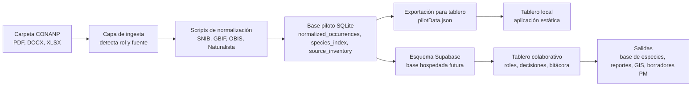

# Briefing Para La Llamada Con CONANP

Fecha: 11 de junio de 2026  
Propósito: explicar el tablero y posicionarlo como una primera base funcional de piloto, no como un producto científico o jurídico final.

## Guion De Apertura

Lo que enviamos es una primera maqueta operativa que muestra cómo CONANP podría pasar de una carpeta con documentos y bases de datos desconectadas a un espacio único, trazable y revisable. El objetivo no es sustituir el criterio técnico de CONANP. El objetivo es liberar al equipo de trabajo repetitivo de consolidación, preservar evidencia, marcar lo que requiere revisión y dar a los especialistas una forma más rápida de validar y usar la información.

El tablero está conectado a la base piloto que construimos a partir de los archivos enviados por CONANP: Decretos, EPJ, referencias de SIG/economía-demografía y bases de biodiversidad provenientes de SNIB, GBIF, Naturalista y OBIS.

## Qué Muestra Realmente El Tablero

- Se normalizaron 181,528 registros de biodiversidad en una estructura común.
- Se generaron 78,511 registros representativos de ocurrencia después de agrupar duplicados probables.
- Se indexaron 12,693 taxa a nivel ANP entre las tres áreas protegidas.
- Cada fila conserva trazabilidad de origen: sistema fuente, archivo, número de fila, ID de registro, licencia, URL/cita cuando está disponible y banderas de calidad.
- El tablero actualmente funciona como maqueta local, con un esquema Supabase listo para despliegue en nube cuando se decida el entorno.

## Explicación Central

El tablero tiene tres funciones principales:

1. **Consolidar**: tomar fuentes heterogéneas y llevarlas a un modelo común.
2. **Auditar**: preservar de dónde salió cada dato para que CONANP pueda defenderlo.
3. **Canalizar trabajo**: mover los registros inciertos a revisión experta en vez de ocultar la incertidumbre.

Por eso el tablero incluye explorador de especies, cola de revisión, inventario de insumos, vista de trazabilidad, módulo de sinónimos, validación GIS, automatización, visualización y una vista previa de borrador para Programa de Manejo.

## Conexión Logística Que Construimos

En esta primera versión, el tablero lee un archivo JSON local generado desde la base SQLite. Eso mantiene la demostración rápida y estable. Para una versión hospedada, las mismas tablas pueden cargarse en Supabase usando el esquema incluido en el repositorio.

## Puntos Defendibles

- **No estamos afirmando validación científica final.** Estamos mostrando que la base de consolidación y trazabilidad funciona.
- **La IA no borra la incertidumbre.** La hace visible mediante banderas de calidad y colas de revisión.
- **Los registros originales se preservan.** La deduplicación crea una capa representativa, pero la trazabilidad cruda permanece.
- **CONANP conserva la autoridad.** La aprobación experta es necesaria para taxonomía, geografía, interpretación jurídica y texto final.
- **El tablero está construido con sus archivos.** Los números no son datos ficticios; vienen de los insumos piloto enviados.
- **Es escalable.** El mismo patrón puede procesar más ANP, fuentes, literatura y futuros conjuntos documentales.
- **Reduce carga manual.** El personal ya no tendría que reconciliar hojas de cálculo completas antes de hacer revisión experta.
- **La funcionalidad más valiosa es la trazabilidad.** Cualquier tabla, recomendación o borrador debe poder regresar a su fuente.

## Preguntas Probables Y Respuestas Sugeridas

**¿Esto ya está validado científicamente?**  
No. Esta es una capa de consolidación y priorización. Prepara los datos para validación científica al preservar evidencia, agrupar duplicados probables y marcar registros que requieren revisión taxonómica o geográfica.

**¿La IA puede eliminar duplicados automáticamente?**  
Puede agrupar duplicados probables y proponer registros representativos. Las reglas finales de fusión deben acordarse con CONANP, especialmente cuando los registros difieren por fuente, fecha, coordenadas o autoridad taxonómica.

**¿Cómo se manejan los sinónimos?**  
En este piloto usamos nombres aceptados o vigentes que ya vienen en las fuentes, como SNIB/CONABIO, GBIF, OBIS/WoRMS y Naturalista. La siguiente versión conectaría APIs de autoridades taxonómicas y requeriría aprobación especialista antes de cambiar nombres aceptados.

**¿Puede revisar si las especies pertenecen geográficamente al ANP?**  
La base está lista porque los registros tienen coordenadas y etiquetas de ANP. El siguiente paso es cargar polígonos oficiales de ANP y referencias biogeográficas/de distribución, para clasificar registros como dentro del polígono, cerca del límite, atípicos o sujetos a revisión.

**¿Qué pasa con publicaciones científicas?**  
El módulo de publicaciones buscaría, filtraría, ingeriría PDFs, extraería menciones/tablas de taxa y las integraría como una fuente separada y trazable. Nunca se deben mezclar registros de literatura en la base sin etiqueta de fuente y estado de revisión.

**¿Puede generar texto para Programas de Manejo?**  
Sí, pero solamente después de tener datos y trazabilidad de fuentes. El módulo de borrador debe generar texto con citas enlazadas y marcar cualquier afirmación no validada como pendiente de revisión.

**¿Por qué Supabase y no Firebase?**  
Supabase es mejor primer ajuste porque los datos son relacionales: ANP, fuentes, ocurrencias, especies, banderas, decisiones de revisión e inventario de insumos. Firebase puede funcionar para interfaces en tiempo real, pero Supabase se adapta mejor a tablas SQL, filtros, relaciones y bitácoras de auditoría.

**¿Esto reemplaza al personal de CONANP?**  
No. Quita trabajo repetitivo de consolidación y da a especialistas una cola de revisión más clara. El valor es enfocar mejor el tiempo experto, no reemplazar la autoridad técnica.

**¿Cómo funcionarían los permisos?**  
Una versión hospedada puede tener roles: consulta, revisor, especialista taxonómico, especialista GIS, revisor jurídico y administrador. Cada decisión puede guardar usuario, fecha, justificación y evidencia fuente.

**¿Cuál es la ruta de implementación?**  
Primero, validar el modelo de datos con este piloto. Segundo, conectar Supabase y revisión por roles. Tercero, agregar polígonos GIS y APIs de autoridades. Cuarto, agregar ingesta de publicaciones. Quinto, agregar generación controlada de borradores.

## Flujo Recomendado De Demostración

1. Abrir el tablero y comenzar con las métricas superiores.
2. Hacer clic en cada tarjeta de ANP y mostrar cómo cambian los números.
3. Abrir el explorador de especies y buscar un taxón reconocible.
4. Abrir el panel lateral de una especie y explicar la trazabilidad.
5. Abrir la cola de revisión y explicar que la incertidumbre se canaliza a especialistas.
6. Abrir la página de pipeline y mostrar el gráfico de valor.
7. Abrir los módulos de GIS, sinónimos y borrador como ejemplos de estado futuro.
8. Cerrar diciendo que la siguiente reunión debe acordar reglas de validación, polígonos, autoridades taxonómicas y entorno de despliegue.

## Solicitud De Cierre

Para pasar de maqueta a piloto operativo necesitamos:

- Polígonos oficiales de las ANP o fuente GIS de referencia.
- Autoridades taxonómicas preferidas por grupo biológico.
- Un flujo de revisión de CONANP: quién aprueba taxonomía, geografía, citas y texto final.
- Permiso para cargar el piloto en un espacio Supabase hospedado o equivalente aprobado por CONANP.
- Acuerdo sobre 1-2 ANP para el siguiente ciclo de prototipo más profundo.

## Propuesta De Valor En Una Frase

Este sistema convierte insumos técnicos desconectados en una base de evidencia trazable, revisable y reutilizable que ayuda a CONANP a producir Programas de Manejo más rápido, manteniendo el control científico e institucional en manos de CONANP.
